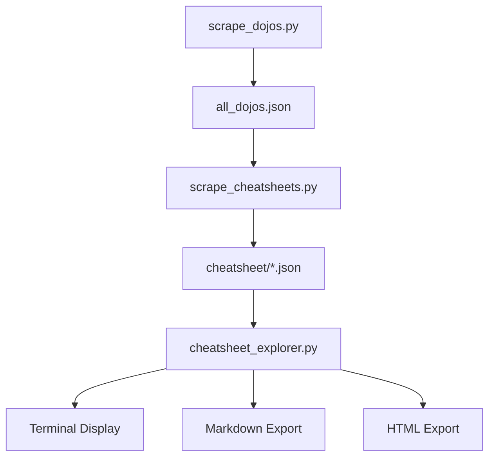

# Cheatsheet Scraper & Explorer

Project Purpose : to scrape and explore programming cheatsheets from ShortcutFoo.com. Easily access keyboard shortcuts and commands for your favorite tools and languages.

## Features ✨
- Scrape all available cheatsheets (dojos) from ShortcutFoo
- Interactive search with fuzzy matching
- Export to terminal, Markdown, or HTML formats
- Beautifully formatted output
- Cross-platform support (Windows/macOS/Linux)

## Prerequisites 📋
- Python 3.8 or higher
- pip package manager

## Installation & Setup 🛠️

### 1. Clone the repository
```bash
git clone https://github.com/your-username/cheatsheet-scraper.git
cd cheatsheet-scraper
```

### 2. Create and activate virtual environment

Windows

```bash
python -m venv venv
venv\Scripts\activate
```


macOS/Linux

```bash
python3 -m venv venv
source venv/bin/activate
```


### 3. Install dependencies
```bash
pip install --upgrade pip
pip install -r requirements.txt
```

## Usage 🚀

### Step 1: Scrape the dojos list
```bash
python src/scrape_dojos.py
```
*Creates `output/all_dojos.json`*

### Step 2: Scrape cheatsheets
```bash
python src/scrape_cheatsheets.py
```
*Scrapes all cheatsheets to `output/cheatsheet/`*

### Step 3: Explore cheatsheets
```bash
python src/cheatsheet_explorer.py
```
*Interactive terminal interface to search and export cheatsheets*

## Workflow Diagram 📊


## Future Updates 🔮
- **GUI Application**: Develop a graphical interface for easier navigation
- **PDF Export**: Add professional PDF export option
- **Auto-update**: Periodic checks for updated cheatsheets
- **Search Enhancement**: Full-text search within cheatsheets
- **Tagging System**: Organize cheatsheets by categories and tags
- **Mobile App**: Create a mobile-friendly version for quick reference
- **Offline Mode**: Package cheatsheets for offline access
- **Customization**: Allow users to create custom cheatsheet bundles

## Disclaimer ⚠️
This project is intended for **educational purposes only**. All cheatsheet content belongs to [ShortcutFoo.com](https://www.shortcutfoo.com) and is used in accordance with their publicly accessible content policy. 

- We only access freely available content
- We do not scrape any paid or restricted content
- We respect copyright and intellectual property rights
- Our intention is to make freely available content more accessible
- We do not support or condone piracy of any kind

Please use this tool responsibly and consider supporting the original content creators at ShortcutFoo.

## Contributing 🤝
Contributions are welcome! Please open an issue first to discuss what you'd like to change.

1. Fork the project
2. Create your feature branch (`git checkout -b feature/AmazingFeature`)
3. Commit your changes (`git commit -m 'Add some AmazingFeature'`)
4. Push to the branch (`git push origin feature/AmazingFeature`)
5. Open a pull request

## License 📄
This project is licensed under the MIT License - see the [LICENSE](LICENSE) file for details.

---

Made with Python. 🐍